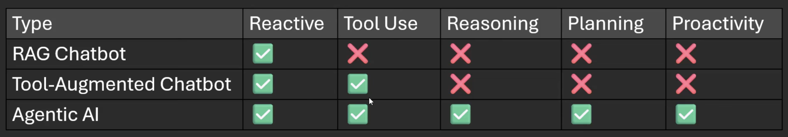
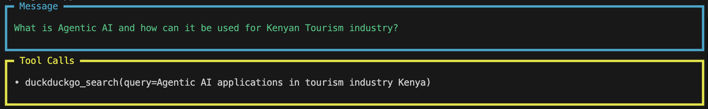
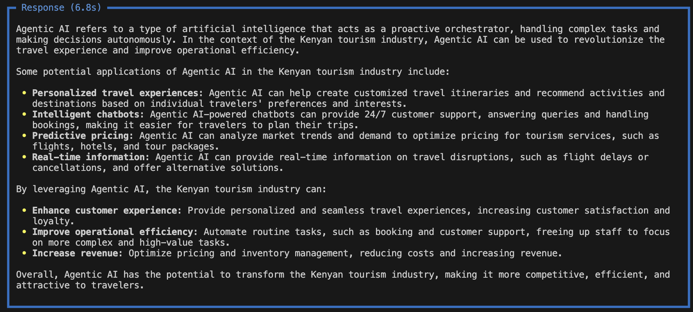

# Agentic-AI-101
### This repo entails autonomous agents, reasoning systems, and next-gen AI workflows. Built with Agno, Groq, and a mix of real-world applications.

## Why Agentic AI?

## Files  
**`simpleagents.py`**:

